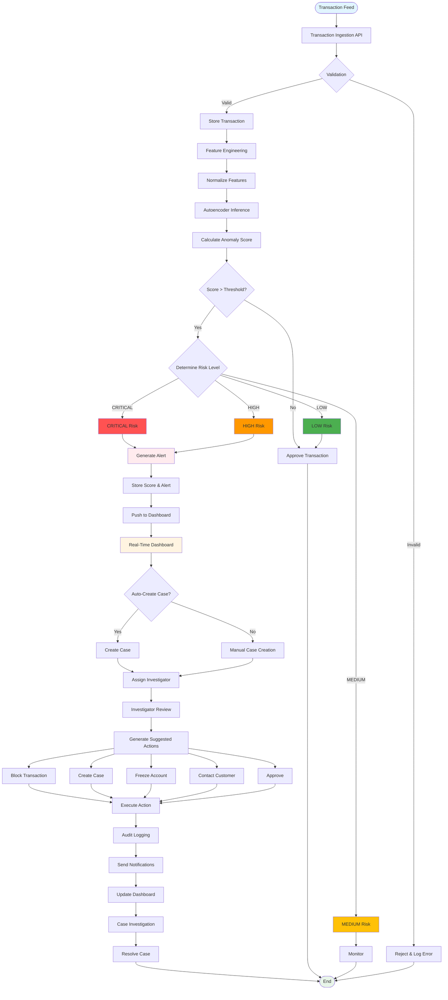
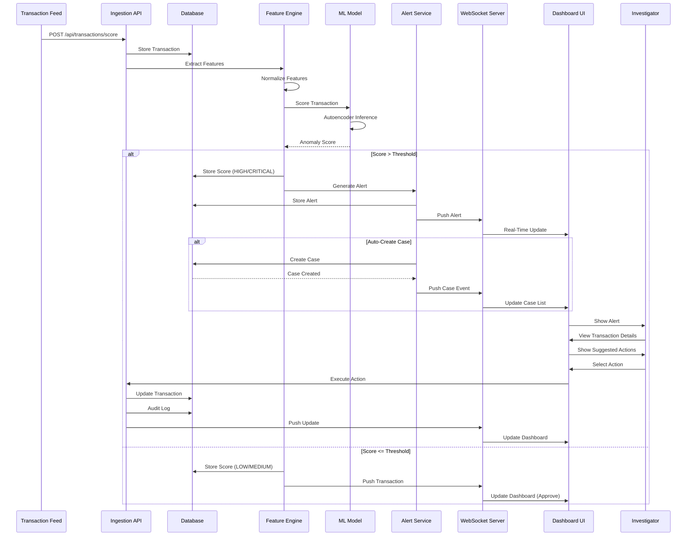
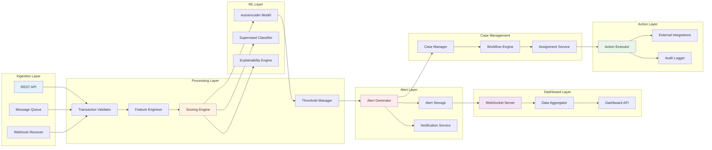
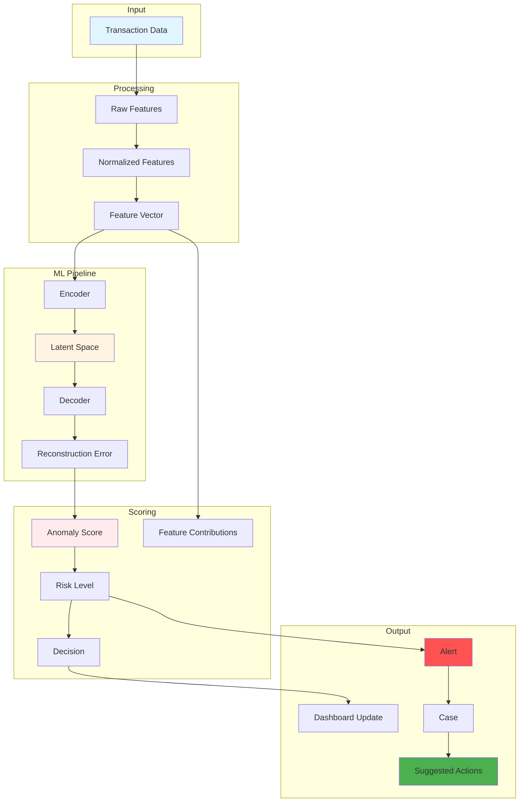
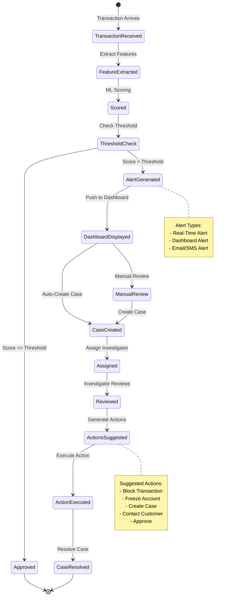
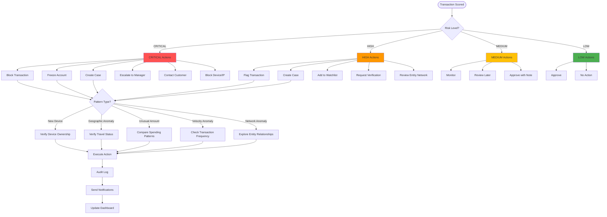

# Process Flow Diagram

## Mermaid Diagram: Real-Time Fraud Detection Flow

## Sequence Diagram: Real-Time Transaction Processing

## Component Interaction Diagram

## Data Flow Diagram

## Alert Lifecycle

## Suggested Actions Decision Tree

